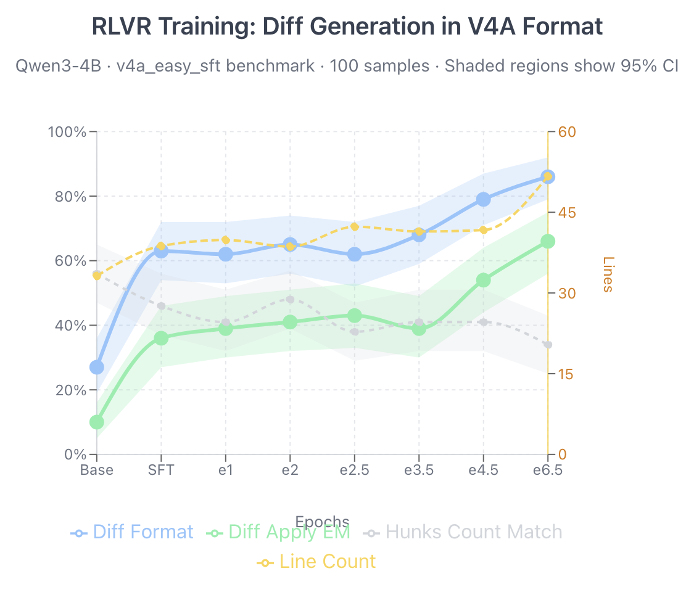
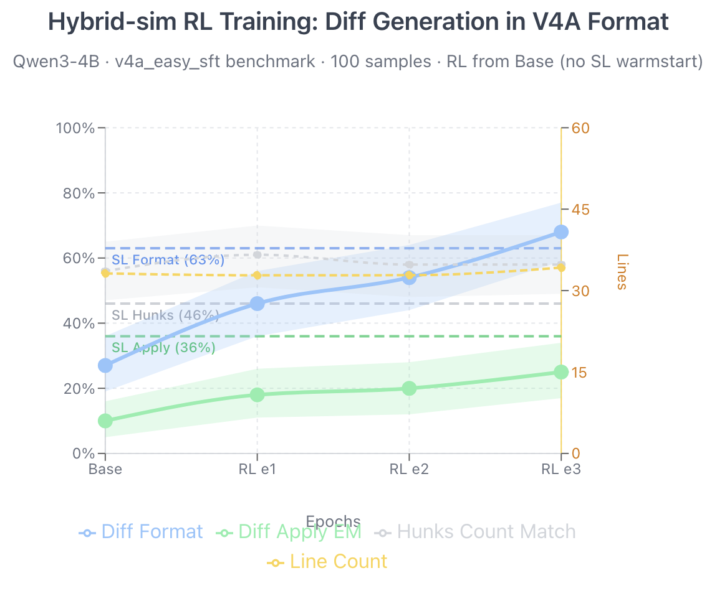

# RLVR on V4A Patch Format

This document explains how to use Reinforcement Learning with Verifiable Rewards (RLVR) on Tinker to train a model to generate minimal, correct patches in the V4A diff format.

## Table of Contents

0. [TL;DR](#tldr-full-sftrl-training-pipeline)
1. [V4A Patch Format](#v4a-patch-format)
2. [RL Environment: 4-Signal Reward](#rl-environment-4-signal-reward)
3. [Training Algorithm](#training-algorithm)
4. [Loss Functions](#loss-functions)
5. [Practical Considerations](#practical-considerations)
6. [Full Pipeline: SL → RL → Eval](#full-pipeline-sl--rl--eval)
7. [Code References](#code-references)
8. [Further Reading](#further-reading)

---

## TL;DR: Full SFT+RL training pipeline

```bash
# 1. SL Training
python -m tinker_cookbook.recipes.chat_sl.run \
    --config tinker_cookbook/recipes/chat_sl/configs/diff_gen_v4a.toml

# 2. Get SL checkpoint
SL_CKPT=$(tinker --format json checkpoint list --run-id "<sl-run-id>:train:0" \
    | jq -r '.checkpoints[-1].tinker_path')

# 3. RL Training from SL
python -m tinker_cookbook.recipes.rlvr.train \
    --config tinker_cookbook/recipes/rlvr/configs/patch_exact_v4a.toml \
    load_checkpoint_path="${SL_CKPT}"

# 4. Get RL checkpoint
RL_CKPT=$(tinker --format json checkpoint list --run-id "<rl-run-id>:train:0" \
    | jq -r '.checkpoints[-1].tinker_path')

# 5. Evaluate
OPENAI_API_KEY="${TINKER_API_KEY}" python src/llm_eval/main.py \
    --task=diff_gen_v4a_easy_sft \
    --experiment experiments/diff-xyz/diff_generation/v4a/qwen3-4b-rl.gin \
    --limit 100 --use_coroutines --rpm_limit 60
```

For dependencies, see [prerequisites](#Prerequisites).
For details see [Full Pipeline: SL → RL → Eval](#full-pipeline-sl--rl--eval).


---

## V4A Patch Format

The V4A format is a stripped-down, file-oriented diff format designed to be easy to parse and safe to apply. Key elements:

```patch
*** Begin Patch
*** Update File: path/to/file.py
@@ class MyClass
@@   def my_method():
 context line before (3 lines recommended)
 context line before
 context line before
-removed line
+added line
 context line after
 context line after
 context line after
*** End Patch
```

**Format rules:**
- Lines starting with `" "` (space) = unchanged context
- Lines starting with `+` = additions
- Lines starting with `-` = deletions
- `@@` markers for navigation (can be nested: class → method)
- Recommended: 3 lines context before + 3 lines after each change

**Reference:** [V4A Format Spec](https://raw.githubusercontent.com/openai/codex/refs/heads/main/codex-rs/apply-patch/apply_patch_tool_instructions.md)


---

## RL Environment: 4-Signal Reward

The `PatchExactMatchMinimalDiffSmallContextEnv` evaluates generated patches using 4 hierarchical signals:

### Signal Definitions

| Signal | Type | Description |
|--------|------|-------------|
| `check_format` | binary | Patch extracts from markdown and applies without exception |
| `check_answer` | binary | Applied result matches `new_code` exactly |
| `check_minimal` | binary | `gen_added == n_added` AND `gen_removed == n_removed` |
| `context_penalty` | float | Penalizes excessive context lines (> 6 per change region) |

### Reward Structure (Hierarchical)

```
┌─────────────────────────────────────────────────────────────┐
│ format fails                           → reward = -0.1      │
├─────────────────────────────────────────────────────────────┤
│ format ok, answer wrong                → reward = 0.2       │
├─────────────────────────────────────────────────────────────┤
│ format ok, answer correct, not minimal → reward = 0.6 - ctx │
├─────────────────────────────────────────────────────────────┤
│ format ok, answer correct, minimal     → reward = 1.0 - ctx │
└─────────────────────────────────────────────────────────────┘
```

Where `ctx` = context_penalty = `min(excess_context × 0.02, 0.2)`

### Example Reward Calculations

**Optimal patch** (2 added, 6 removed, 18 context lines, 3 change regions):
- format: ✓, answer: ✓, minimal: ✓
- expected_context = 3 × 6 = 18, excess = 0, penalty = 0
- **Reward = 1.0**

**Verbose but correct patch** (2 added, 6 removed, 32 context lines, 2 change regions):
- format: ✓, answer: ✓, minimal: ✓
- expected_context = 2 × 6 = 12, excess = 20, penalty = 0.2 (capped)
- **Reward = 1.0 - 0.2 = 0.8**

**Bulk-replace patch** (9 added, 8 removed vs ground truth 2/6):
- format: ✓, answer: ✓, minimal: ✗
- **Reward = 0.6 - context_penalty**

---

## Training Algorithm

### High-Level Flow

```
┌─────────────────────────────────────────────────────────────────────┐
│                         Training Loop                                │
├─────────────────────────────────────────────────────────────────────┤
│                                                                      │
│  ┌──────────────┐    ┌──────────────┐    ┌──────────────┐           │
│  │   Dataset    │───▶│   Rollout    │───▶│  Advantages  │           │
│  │  (problems)  │    │  (sampling)  │    │ (centering)  │           │
│  └──────────────┘    └──────────────┘    └──────────────┘           │
│         │                   │                   │                    │
│         ▼                   ▼                   ▼                    │
│  ┌──────────────┐    ┌──────────────┐    ┌──────────────┐           │
│  │ EnvGroup     │    │ Trajectory   │    │   Training   │           │
│  │ Builders     │    │   Groups     │    │    Step      │           │
│  └──────────────┘    └──────────────┘    └──────────────┘           │
│                                                                      │
└─────────────────────────────────────────────────────────────────────┘
```

### Step 1: Data Loading

📄 [`train.py`](train.py) → `TemplateRLDataset.get_batch()`

```python
# For each problem in the batch
env_group_builders = dataset.get_batch(i_batch)

# Each builder creates group_size environments (e.g., 8)
# Same problem, independent rollouts
```

**Key concept:** Each problem gets `group_size` independent attempts. This is crucial for advantage computation.

### Step 2: Rollout (Sampling)

📄 [`tinker_cookbook/rl/rollouts.py`](../../rl/rollouts.py) → `do_group_rollout()`

```python
# For each environment in the group
for env in env_group:
    # Get initial observation (the prompt)
    observation = env.get_initial_observation()
    
    # Policy generates a response (the patch)
    action = await policy(observation, stop_condition)
    
    # Environment evaluates with 4 signals
    step_result = await env.step(action)
    # Returns: reward, metrics={format, correct, minimal, context_penalty}
```

**Example rollout results for one problem:**

| Rollout | format | answer | minimal | ctx_penalty | Reward |
|---------|--------|--------|---------|-------------|--------|
| 1 | ✗ | - | - | 0 | -0.1 |
| 2 | ✓ | ✗ | - | 0 | 0.2 |
| 3 | ✓ | ✓ | ✗ | 0.08 | 0.52 |
| 4 | ✓ | ✓ | ✓ | 0.06 | 0.94 |
| 5 | ✓ | ✓ | ✓ | 0.02 | 0.98 |
| 6 | ✓ | ✓ | ✗ | 0.12 | 0.48 |
| 7 | ✓ | ✗ | - | 0 | 0.2 |
| 8 | ✓ | ✓ | ✓ | 0.00 | 1.0 |

### Step 3: Advantage Computation (Critical!)

📄 [`tinker_cookbook/rl/data_processing.py`](../../rl/data_processing.py) → `compute_advantages()`

```python
def compute_advantages(trajectory_groups):
    for traj_group in trajectory_groups:
        rewards = torch.tensor(traj_group.get_total_rewards())
        advantages = rewards - rewards.mean()  # CENTER WITHIN GROUP
    return advantages
```

**From the example above:**
- Rewards: `[-0.1, 0.2, 0.52, 0.94, 0.98, 0.48, 0.2, 1.0]`
- Mean: `0.528`
- Advantages: `[-0.628, -0.328, -0.008, +0.412, +0.452, -0.048, -0.328, +0.472]`

**Why this matters:**
- Rollouts with reward < mean get **negative advantage** → discourage
- Rollouts with reward > mean get **positive advantage** → reinforce
- Even a "correct" rollout (reward 0.52) can have negative advantage if others did better!

### Step 4: Training Data Assembly

📄 [`tinker_cookbook/rl/data_processing.py`](../../rl/data_processing.py) → `assemble_training_data()`

```python
# Each token in the action gets the trajectory's advantage
for transition in trajectory.transitions:
    advantages.extend([0] * len(observation_tokens))  # No gradient on prompt
    advantages.extend([traj_advantage] * len(action_tokens))  # Learn from response
```

The model learns to:
- **Increase probability** of tokens from high-advantage rollouts
- **Decrease probability** of tokens from low-advantage rollouts

### Step 5: Gradient Update

📄 [`tinker_cookbook/rl/train.py`](../../rl/train.py) → `train_step()`

```python
# Forward-backward pass computes gradients
fwd_bwd = await training_client.forward_backward_async(data, loss_fn=loss_fn)

# Optimizer step updates weights
await training_client.optim_step_async(adam_params)

# Get new sampler for next iteration
sampling_client = await training_client.save_weights_and_get_sampling_client_async()
```

---

## Loss Functions

Tinker supports two main RL loss functions: `importance_sampling` and `ppo`.

### The Off-Policy Problem

The **sampler** (generates rollouts) and **learner** (being trained) can drift apart due to:
- GPU non-determinism
- Multiple gradient steps between sampler updates
- Async training with stale samples

Both losses handle this, but differently.

### Loss 1: `importance_sampling`

**Formula:**
$$\mathcal{L}_{\text{IS}} = -\sum_t \frac{p_\theta(x_t)}{q(x_t)} \cdot A_t$$

**Implementation:**
```python
prob_ratio = torch.exp(target_logprobs - sampling_logprobs)  # p/q
loss = -(prob_ratio * advantages).sum()
```

**Properties:**
- ✅ Unbiased gradient estimate
- ✅ Higher sample efficiency
- ⚠️ Unbounded ratio can cause instability
- ⚠️ Can make large policy changes in one step

### Loss 2: `ppo` (Proximal Policy Optimization)

**Formula:**
$$\mathcal{L}_{\text{PPO}} = -\sum_t \min\left(\frac{p_\theta}{q} \cdot A_t,\; \text{clip}\left(\frac{p_\theta}{q}, 0.8, 1.2\right) \cdot A_t\right)$$

**Implementation:**
```python
prob_ratio = torch.exp(target_logprobs - sampling_logprobs)
clipped_ratio = torch.clamp(prob_ratio, 0.8, 1.2)  # ε = 0.2

unclipped = prob_ratio * advantages
clipped = clipped_ratio * advantages
loss = -torch.min(unclipped, clipped).sum()
```

**Properties:**
- ✅ Bounded updates (±20% policy change)
- ✅ More stable training
- ✅ Works well with stale samples
- ⚠️ Lower sample efficiency (clips extreme signals)

### Comparison

| Aspect | `importance_sampling` | `ppo` |
|--------|----------------------|-------|
| Update size | Unbounded | Clipped to ±20% |
| Stability | Can diverge | More stable |
| Sample efficiency | Higher | Lower |
| Best for | Fresh on-policy samples | Off-policy/multi-epoch |

### Recommendation

| Scenario | Recommended |
|----------|-------------|
| On-policy, 1 gradient step per batch | `importance_sampling` |
| Multiple gradient steps (`num_substeps > 1`) | `ppo` |
| Async training | `ppo` |
| Fast iteration, willing to tune LR | `importance_sampling` |

---

## Practical Considerations

### Hyperparameters

```toml
# Example config for patch training
model_name = "Qwen/Qwen3-8B"
group_size = 4        # Rollouts per problem (more = better advantage estimate)
batch_size = 8        # Problems per batch
learning_rate = 1e-5  # Start conservative
max_tokens = 2048     # Max patch length
temperature = 0.7     # Sampling temperature
loss_fn = "importance_sampling"  # or "ppo"
```

### Key Metrics to Monitor

| Metric | What it tells you |
|--------|-------------------|
| `train/format_mean` | Are patches syntactically valid? |
| `train/correct_mean` | Are patches producing correct output? |
| `train/minimal_mean` | Are patches optimally sized? |
| `train/context_penalty_mean` | How verbose are the patches? |
| `train/reward_mean` | Overall performance |
| `train/reward_std` | Diversity of outcomes (low = all similar) |

### Common Issues

**All rewards are the same (no gradient):**
- Increase `group_size` for more diverse samples
- Check if task is too easy or too hard
- Enable `remove_constant_reward_groups=True`

**Training unstable:**
- Switch from `importance_sampling` to `ppo`
- Lower learning rate
- Add KL penalty (`kl_penalty_coef > 0`)

**Model produces verbose patches:**
- Context penalty should drive this down over time
- Check that `count_context_and_changes` is working correctly

**Model produces "bulk replace" patches:**
- `check_minimal` signal should discourage this
- Verify `n_added`/`n_removed` in dataset are correct

### Testing Your Environment

📄 [`tinker_cookbook/rl/play_w_env.py`](../../rl/play_w_env.py) — Interactive environment debugger

Or use `play_env()` to manually test your environment on a fixture by typing responses:

```bash
python -c "
import asyncio
from tinker_cookbook.renderers import get_renderer
from tinker_cookbook.tokenizer_utils import get_tokenizer
from tinker_cookbook.recipes.rlvr.patch_env import PatchExactMatchMinimalDiffSmallContextEnv
from tinker_cookbook.rl.play_w_env import play_env

row = {
    'old_code': 'def greet():\n    print(\"Hi\")\n',
    'new_code': 'def greet():\n    print(\"Hello\")\n',
    'n_added': 1,
    'n_removed': 1,
}
tok = get_tokenizer('Qwen/Qwen3-8B')
renderer = get_renderer('qwen3', tok)
env = PatchExactMatchMinimalDiffSmallContextEnv(
    question='Change Hi to Hello',
    answer='(patch)',
    row=row,
    renderer=renderer,
)
asyncio.run(play_env(env, tok))
"
```

You can also run `play_w_env.py` directly with your own environment setup:

```bash
python -m tinker_cookbook.rl.play_w_env
```

---

## Full Pipeline: SL → RL → Eval

The complete post-training pipeline consists of three stages:

```
┌─────────────────────────────────────────────────────────────────────────────┐
│                          Post-Training Pipeline                             │
├─────────────────────────────────────────────────────────────────────────────┤
│                                                                             │
│   ┌─────────────┐      ┌─────────────┐      ┌─────────────┐                 │
│   │     SL      │ ───▶ │     RL      │ ───▶ │    Eval     │                 │
│   │  (warmup)   │      │  (refine)   │      │  (measure)  │                 │
│   └─────────────┘      └─────────────┘      └─────────────┘                 │
│                                                                             │
│   Base model           SL checkpoint        RL checkpoint                   │
│   learns format        learns rewards       measured on                     │
│   from examples        from exploration     held-out test                   │
│                                                                             │
└─────────────────────────────────────────────────────────────────────────────┘
```

### Prerequisites

```bash
# Install dependencies
pip install tinker-cookbook
pip install llm-eval

# Sign up at https://auth.thinkingmachines.ai/sign-up 
# Set up an API key
export TINKER_API_KEY="your-key-here"
```

---

### Stage 1: Supervised Learning (SL)

SL provides a warm start by teaching the model the v4a format from examples.

#### Config: `configs/diff_gen_v4a.toml`

```bash
# Option 1: Using config file
python -m tinker_cookbook.recipes.chat_sl.run \
    --config tinker_cookbook/recipes/chat_sl/configs/diff_gen_v4a.toml

# Option 2: CLI args (for quick experiments)
python -m tinker_cookbook.recipes.chat_sl.train \
    model_name=Qwen/Qwen3-4B-Instruct-2507 \
    dataset=bzz2/diff-xyz-v4a \
    dataset_config=easy \
    test_split=validation \
    user_template="$(cat configs/v4a_prompt.txt)" \
    assistant_template='```diff\n{v4a}\n```' \
    learning_rate=5e-4 \
    batch_size=16 \
    lora_rank=64 \
    wandb_project=tinker-diff_gen_v4a-sl
```

#### Debug SL Dataset (Optional)

```bash
# Visualize what the model will see during training
python -m tinker_cookbook.supervised.viz_sft_dataset \
    --dataset_name="bzz2/diff-xyz-v4a" \
    --dataset_config=easy \
    --dataset_split=train \
    --config tinker_cookbook/recipes/chat_sl/configs/diff_gen_v4a.toml
```

#### Get SL Checkpoint Path

```bash
# List checkpoints from your SL run
tinker --format json checkpoint list --run-id "<your-sl-run-id>:train:0" \
    | jq -r '.checkpoints[].tinker_path'

# Example output:
# tinker://83630c19-e5a0-58b2-aaf9-6f08f3bc4305:train:0/weights/final
```

---

### Stage 2: Reinforcement Learning (RL)

RL refines the SL model using reward signals from the environment.
Current script only supports training for 1 epoch. 
See below how to resume training for the next epoch.


#### Run RL from SL Checkpoint

```bash
python -m tinker_cookbook.recipes.rlvr.train \
    --config tinker_cookbook/recipes/rlvr/configs/patch_exact_v4a.toml \
    load_checkpoint_path='tinker://<sl-run-id>:train:0/weights/final'
```

#### Resume RL Training

```bash
# Continue from where you left off e.g. previous epoch (same log_path)
python -m tinker_cookbook.recipes.rlvr.train \
    --config tinker_cookbook/recipes/rlvr/configs/patch_exact_v4a.toml \
    log_path='logs/rlvr-diff-xyz-v4a-Qwen-Qwen3-4B-Instruct-2507-gs4-bs8-lr1e-<date>'
```

#### Offline Evaluation (Quick Check)

```bash
# Evaluate without running full training
python -m tinker_cookbook.recipes.rlvr.offline_eval \
    --config tinker_cookbook/recipes/rlvr/configs/patch_exact_v4a.toml \
    load_checkpoint_path=tinker://<checkpoint-path> \
    max_eval_samples=32
```

---

### Stage 3: Evaluation with llm-eval

Use `llm-eval` for comprehensive benchmarking against held-out test sets.

#### 1. Get RL checkpoint path

```bash
# List checkpoints from your RL run
tinker --format json checkpoint list --run-id "<your-rl-run-id>:train:0" \
    | jq -r '.checkpoints[].tinker_path'

# Example output:
# tinker://aa7b7143-ec73-5dc5-b71c-6182b8570ac3:train:0/sampler_weights/Qwen3-4B-Inst_v4a-exact_000045
```

#### 2. Create .gin config for experiment

Create `experiments/diff-xyz/diff_generation/v4a/qwen3-4b-rl.gin`:

```python
include 'experiments/diff-xyz/diff_generation/v4a/base_instruct_latest.gin'
import llm_eval.common.model

Experiment.description = """RLVR over SFT: Qwen3-4b with 4-signal reward"""

Experiment.model_cls = @OpenaiCompatibleApiModel
Experiment.model_hparam = {"temperature": 0, "max_tokens": 4096}

# Point to Tinker checkpoint via OpenAI-compatible API
OpenaiCompatibleApiModel.base_url = "https://tinker.thinkingmachines.dev/services/tinker-prod/oai/api/v1"
OpenaiCompatibleApiModel.model_name = "tinker://<run-id>/sampler_weights/Qwen3-4B-Inst_v4a-minimal_final"
```

#### 3: Run the experiment

```bash
# Evaluate RL checkpoint in parallel in 60 RPM
time OPENAI_API_KEY="${TINKER_API_KEY}" python src/llm_eval/main.py \
    --task=diff_gen_v4a_easy_sft \
    --experiment experiments/diff-xyz/diff_generation/v4a/qwen3-4b-rl.gin \
    --limit 100 \
    --use_coroutines \
    --rpm_limit 60
```


### Tinker checkpoint management

```bash
# List all checkpoints for a run
tinker --format json checkpoint list --run-id "<run-id>:train:0" \
    | jq -r '.checkpoints[].tinker_path'

# Delete all checkpoints for a run (careful!)
tinker --format json checkpoint list --run-id "<run-id>:train:0" \
    | jq -r '.checkpoints[].tinker_path' \
    | xargs tinker checkpoint delete -y
```

---


### Experimental findings

#### Apply only

TK: add

#### PatchExactMatchEnv 
Results from training Qwen3-4B on v4a patch generation using 2-signal reward
 * format correctness
 * exact match (`apply_patch(old_code, pach) == new code`)



<details>

<summary>generate plot</summary>

```
./scripts/plot_v4a_rl_metrics.py --task diff_gen_v4a_easy_sft \
    --experiments experiments/diff-xyz/diff_generation/v4a/qwen3-4b-instruct-tinker-api_instruct.gin experiments/diff-xyz/diff_generation/v4a/qwen3-4b-instruct-tinker-api-sft_instruct.gin experiments/diff-xyz/diff_generation/v4a/qwen3-4b-instruct-tinker-api-rl-sft-exact_instruct_*.gin \
    --output PatchExactMatchEnv.png
```
</details>

| Stage | Hunks Match | Diff Format | Diff Apply EM | Avg Lines |
|-------|-------------|-------------|---------------|-----------|
| Base  | 0.56        | 0.27        | 0.10          | 33.2      |
| SL    | 0.46        | 0.63        | 0.36          | 38.7      |
| RL e1 | 0.41        | 0.62        | 0.39          | 39.8      |
| RL e2 | 0.48        | 0.65        | 0.41          | 38.6      |
| RL e4.5 | 0.41      | 0.79        | 0.54          | 41.7      |
| RL e6.5 | 0.34      | **0.86**    | **0.66**      | 51.7      |

**Key observations:**
- **Diff Format** improves steadily: 0.27 → 0.63 (SL) → 0.86 (RL)
- **Diff Apply EM** (exact match) improves: 0.10 → 0.36 (SL) → 0.66 (RL)
- **Hunks Match** decreases slightly as model consolidates edits differently
- **Line count** increases as model learns to include more context without context size penalty

* Diff parsing and apply success both improve steadily through training, with e4.5 showing the clearest gains (+16pp parsing, +18pp apply vs base).
* Hunks match continues to drop though (0.46 → 0.34), suggesting the model may be consolidating edits into fewer hunks or structuring them differently than the ground truth, even when the result applies correctly
* Line count creeping up at e6.5 as the model is learning to include more context


#### PatchExactMatchMinimalDiffWideGapEnv

TK: wider gaps to addess Compressed Advantage Magnitude

TK: gradual reward for minimality to address The Binary Cliff Problem / discontinous jump in the reward


#### PatchExactMatchMinimalDiffSmallContextEnv

Results from training Qwen3-4B on v4a patch generation using hierarchical 4-signal reward:
  1. check_format: patch extracts and applies without exception
  2. check_answer: applied result matches new_code exactly
  3. check_minimal: `gen_added == n_added AND gen_removed == n_removed`
  4. context_penalty: penalizes excessive context lines

Cost
* train $1.35, 8.75M
* eval $0.05




<summary>generate plot</summary>

```
./scripts/plot_v4a_rl_metrics.py --task diff_gen_v4a_easy_sft \
    --baseline experiments/diff-xyz/diff_generation/v4a/qwen3-4b-instruct-tinker-api-sft_instruct.gin \
    --experiments experiments/diff-xyz/diff_generation/v4a/qwen3-4b-instruct-tinker-api_instruct.gin experiments/diff-xyz/diff_generation/v4a/qwen3-4b-instruct-tinker-rl-hybrid-sim_instruct_*e.gin \
    --output PatchHybridSimilarityEnv.png
```
</details>


| Model | Hunks Match | Diff Parsing | Diff Apply | Line Count |
|-------|-------------|--------------|------------|------------|
| Qwen3-4B-Inst (base) | 0.560 | 0.270 | 0.100 | 33.17 |
| Qwen3-4B-Inst + SFT | 0.460 | 0.630 | **0.360** | 38.74 |
| Qwen3-4B-Inst + Hybrid-sim RL (1e) | **0.610** | 0.460 | 0.180 | 32.82 |
| Qwen3-4B-Inst + Hybrid-sim RL (2e) | 0.580 | 0.540 | 0.200 | 32.84 |
| Qwen3-4B-Inst + Hybrid-sim RL (3e) | 0.580 | **0.680** | 0.250 | 34.23 |

**Key observations:**
- SFT achieves the best diff apply rate (36%)
- Pure RL w\ similarity-based reward improves parsing rate (46% → 68%)
  It succeds in teaching v4a format from cold start by giving positive reward to format failures that are "close" to correct, helping bootstrap format learning

TODOs
* Move "Run" part in README.md?
* Add hparam sweep in there?

---

## Code References

- **Environment:** `tinker_cookbook/recipes/rlvr/patch_env.py`
- **Patch parser:** `tinker_cookbook/recipes/rlvr/apply_patch_memfs.py`
- **Training loop:** `tinker_cookbook/rl/train.py`
- **RLVR runner:** `tinker_cookbook/recipes/rlvr/train.py`
- **SL runner:** `tinker_cookbook/recipes/chat_sl/train.py`
- **Advantage computation:** `tinker_cookbook/rl/data_processing.py`
- **Configs:** `tinker_cookbook/recipes/rlvr/configs/`

---

## Further Reading

- [Tinker Losses Documentation](../../../docs/losses.mdx)
- [RL Training Guide](../../../docs/rl/rl-loops.mdx)

